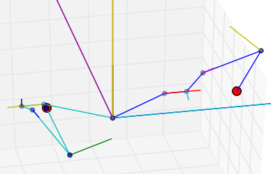

# IKPy #

[](https://pypi.python.org/pypi/poppy_inverse_kinematics/)
[](http://poppy-inverse-kinematics.readthedocs.org/en/latest/?badge=latest)
[](https://pypi.python.org/pypi/poppy_inverse_kinematics/)
[](https://pypi.python.org/pypi/poppy_inverse_kinematics/)
[](http://mybinder.org/repo/Phylliade/poppy-inverse-kinematics)



# Installation
You have two options :


1. From PyPI (recommended) : Simply run :

   ```bash
   pip install poppy-inverse-kinematics
   ```
2. From source : First download and extract the archive, then run :

   ```bash
   pip install ./
   ```    
   NB : You must have the proper rights to execute this command

# Tutorials
You can find tutorials in the IPython [notebooks](https://github.com/Phylliade/ikpy/tree/master/notebooks).

# API Documentation
An extensive documentation of the API can be found [here](http://poppy-inverse-kinematics.readthedocs.org).


# Dependencies and compatibility
The library can work with both versions of Python (2.7 and 3.x).
It requires numpy and scipy.

Sympy is not mandatory, but highly recommended, for fast hybrid computations, that's why it is installed by default.

Matplotlib is optional : it is used to plot (in 3D) your models.
