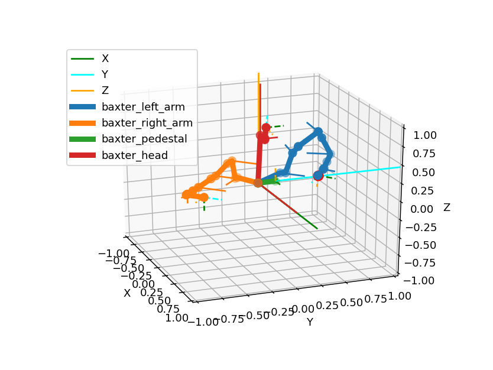

# IKPy #

[](https://gitter.im/Phylliade/ikpy?utm_source=badge&utm_medium=badge&utm_campaign=pr-badge&utm_content=badge)

[](https://pypi.python.org/pypi/ikpy/)
[](http://ikpy.readthedocs.org/en/latest/?badge=latest)
[](https://pypi.python.org/pypi/ikpy/)
[](http://mybinder.org/repo/Phylliade/ikpy)




# Demo

Live demos of what IKPy can do (click on the image below to see the video):

[](https://www.youtube.com/watch?v=H0ysr5qSbis)
[](https://www.youtube.com/watch?v=Jq0-DkEwwj4)

Also, a presentation of IKPy: [Presentation](https://github.com/Phylliade/ikpy/blob/master/tutorials/IKPy%20speech.pdf).

# Features
With IKPy, you can:

* Compute the **Inverse Kinematics** of every existing robot.
* Compute the Inverse Kinematics in **position, orientation**, or both
* Define your kinematic chain using **arbitrary representations**: DH (Denavit–Hartenberg), URDF, custom...
* Automaticly import a kinematic chain from a **URDF file**.
* Use pre-configured robots, such as **baxter** or the **poppy-torso**
* IKPy is **precise** (up to 7 digits): the only limitation being your underlying model's precision, and **fast**: from 7 ms to 50 ms (depending on your precision) for a complete IK computation.
* **Plot** your kinematic chain: no need to use a real robot (or a simulator) to test your algorithms!
* Define your own Inverse Kinematics methods.

Moreover, IKPy is a **pure-Python library**: the install is a matter of seconds, and no compiling is required.

# Installation
You have three options:


1. From PyPI (recommended) - simply run:

   ```bash
   pip install ikpy
   ```
  If you intend to plot your robot, you can install the plotting dependencies (mainly `matplotlib`):
  ```bash
  pip install 'ikpy[plot]'
  ```

2. If you work with Anaconda, there's also a Conda package of IKPy:
  ```
  conda install -c https://conda.anaconda.org/phylliade ikpy
  ```

3. From source - first download and extract the archive, then run:

   ```bash
   pip install ./
   ```
   NB: You must have the proper rights to execute this command

# Quickstart
Follow this IPython [notebook](https://github.com/Phylliade/ikpy/blob/master/tutorials/Quickstart.ipynb).

# Guides and Tutorials
Go to the [wiki](https://github.com/Phylliade/ikpy/wiki). It should introduce you to the basic concepts of IKPy.

# API Documentation
An extensive documentation of the API can be found [here](http://ikpy.readthedocs.org).

# Dependencies and compatibility
The library can work with both versions of Python (2.7 and 3.x).
It requires `numpy` and `scipy`.

`sympy` is highly recommended, for fast hybrid computations, that's why it is installed by default.

`matplotlib` is optional: it is used to plot your models (in 3D).


# Contributing
IKPy is designed to be easily customisable: you can add your own IK methods or robot representations (such as DH-Parameters) using a dedicated [developer API](https://github.com/Phylliade/ikpy/wiki/Contributing).

Contributions are welcome: if you have an awesome patented (but also open-source!) IK method, don't hesitate to propose adding it to the library!

# Links
* If performance is your main concern, `aversive++` has an inverse kinematics [module](https://github.com/AversivePlusPlus/ik) written in C++, which works the same way IKPy does.
