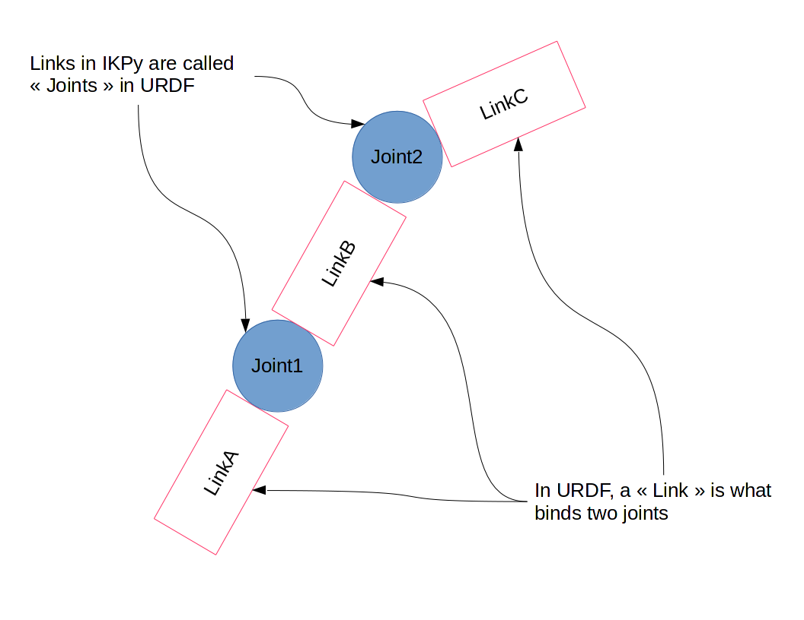
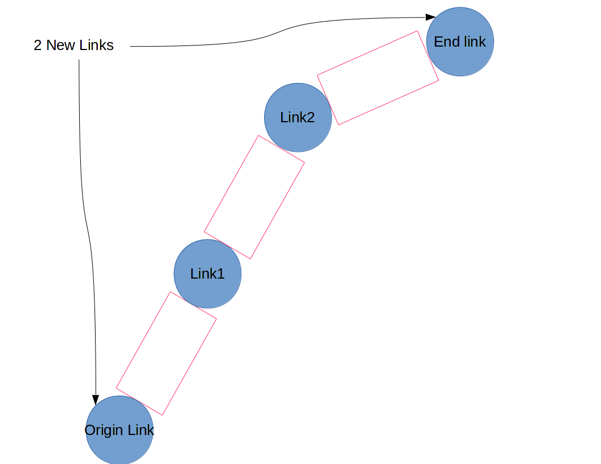

# URDF parsing and importing #

URDF parsing is done via the class method `from_urdf_file` of the `Chain` class.

There are multiple things to consider to parse a URDF file :

# URDF and IKPy conventions
An URDF robot is made of links and joints : each joint represents a motor, and is bound to two links : his parent link and his child link.

Be careful, the `links` of IKPy (and of the matlab toolbox) are more related to the URDF `joints`!

On the picture below, here we have a robot arm in the URDF style :

In the URDF style, the robot generally begins and ends with a "URDF Link", which don't exist in our IKPy representation.

That's why IKPy automatically adds two links (this time IKPy Links), at the beginning and the end of our robot :

# Giving the base elements
If your robot is not a linear chain (for example a humanoid), you must extract your chain in your URDF file.
To achieve this, the import function uses the parameter `base_elements`

# Using a last_link_vector

# Specifying a chain mask
