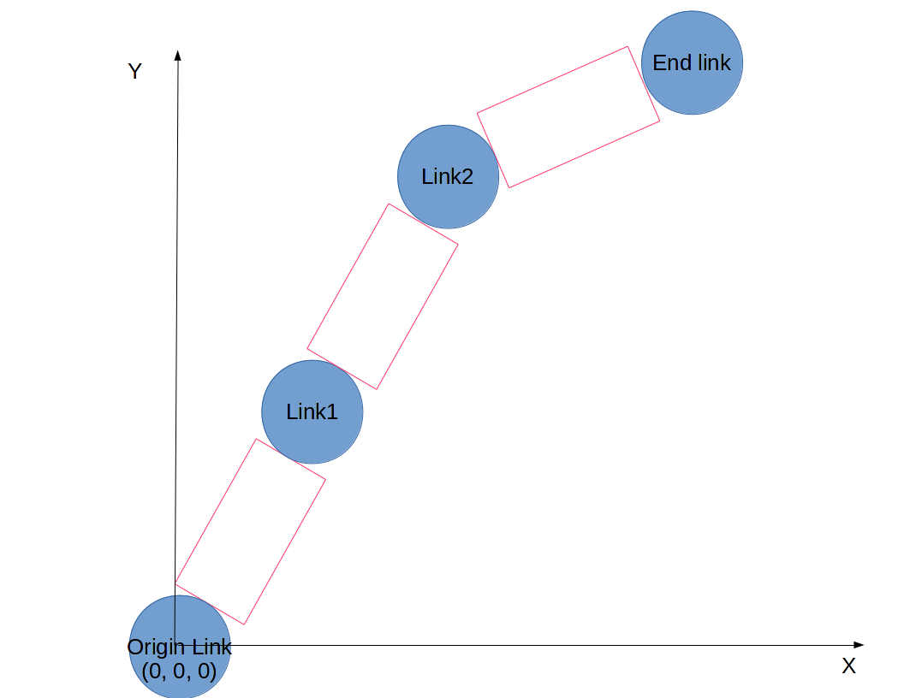

# Chain #

The `Chain` is the main object of IKpy. It provides the Inverse Kinematics and Forward Kinematics methods, as long as other helper methds (URDF import, plotting...)

# Chain structure

A chain is basically a list of `Link` objects.
Each link has a position and an orientation, that are stored in its transformation matrix (for more details, go to the [links](https://github.com/Phylliade/ikpy/wiki/Link) section of the doc).
Moreover, each link represents a motor (currently revolute with one degree of freedom), that moves the next links.

Let's consider the 2D robot below :


The first link (called the "Origin" link) is the origin of the frame, at position (0, 0, 0).
The last link is the end effector of the chain. Being the last link, its degree of freedom is purely virtual and has no interest : this link can't move anything. It's just here to have a position.

# Creating a chain
To create a chain, you have currently two choices :
1. Create manually a list of links, and then create a chain from this list
2. Automatically import a chain from an URDF file.

If you have a URDF file of your robot or the possibility to create one, the 2nd option is recommended.
If you can't have a URDF file, or you robot is described in another representation (ex : DH-parameters), you can fallback to the first option.

## Manually
You just have to give a list of links to create your `Chain` object.

For example, for the robot above :
```
Chain([originlink, link1, link2, endlink])
```

## From an URDF file
Jump to the dedicated [page](https://github.com/Phylliade/ikpy/blob/master/tutorials/ikpy/URDF.md)!

# The mask of active links
Sometimes, you will want some links to appear in your chain, but not to be managed by inverse kinematics.
For exemple, for an humanoid, an arm chain could begin a the hip, go along the left shoulder and the arm and finish on the left hand. Here you only want to move the arm itself, thus the links before the shoulder would be set as inactive.

To achieve this, you must provide a list of booleans `mask` :
`mask[k] is True` tells IKPy that the link at index k is active.

For the robot described above, a mask like :
```
active_links_mask = [False, True, True, True]
```
would activate Link1 and Link2, but not Origin Link.

Note that the mask on the last link has no effect, because this one has no degree of freedom.
