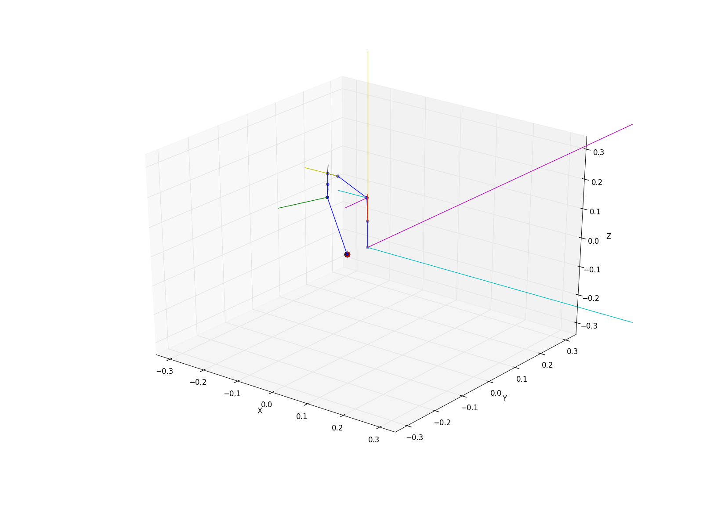
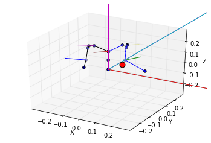

# Plotting #

The whole plotting is made through the `plot` method of the chain object.

For example :

Each link is displayed as a blue dot.
For each link, the rotation axe is  the colored axe coming from the blue dot.
The red dot is the target of the Inverse Kinematics.
(You can see that the robot end is exactly on the target position)

You can call it with no argument : it will plot your chain in a matplotlib figure.

The `plot` method can handle more advanced features, such as plotting a target or plotting multiple chain in the same figure.

# Plotting multiple targets on the same figure
Say you have two chains `left_arm` and `right_arm`, each one representing an arm of an humanoid, and you want to display them on the same figure.

You only have to pass the same matplotlib axes object, say `ax`, to the plot `method`.

```
# Use the same axes object on your plot method
left_arm.plot(joints, ax)
right_arm.plot(joints, ax)

# Display you axes object
matplotlib.pyplot.show()
```

For example :


## Creating an `axes` object
To create an `axes` object, you can use this snippet :
```
# Import the 3D packages of matplotlib
import matplotlib.pyplot
from mpl_toolkits.mplot3d import Axes3D

# Create your axes object
ax = matplotlib.pyplot.figure().add_subplot(111, projection='3d')
```

# Plotting a target with your chain
For inverse kinematics, it can be useful to display the target of your chain along of your chain.
To achieve this, just pass a 3D vector to the `target` parameter of the `plot` method.
